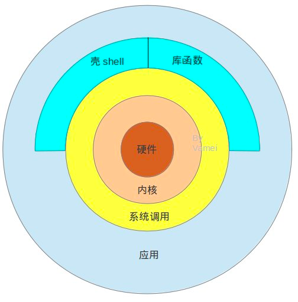
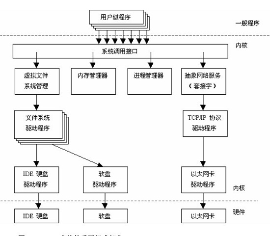
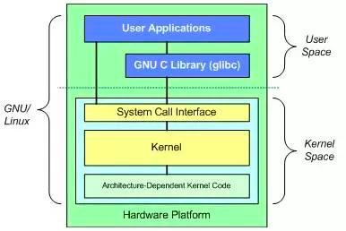
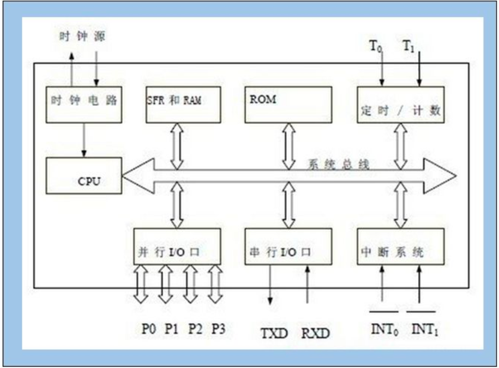

# Linux架构简介

### 四个主要组成部分：

内核 ，shell ，文件系统和应用程序。

内核中充满了各种驱动程序，CPU，内存，硬盘和网络等都需要通过内核传递给硬件。正因为这样，linux系统才被称之为linux。
它负责着进程，内存，设备驱动，文件和网络系统，决定着性能和稳定性。

shell其实是一个命令解释器，它可以接受输入解释成系统能识别的代码，传递给系统调用。

文件系统决定了文件存放在磁盘等存储设备上的组织方法，一般都有所对应的物理空间。

### 附图：51单片机组成

### 附和知识点：
#### 硬件的基础知识：
二极管
门电路
锁存器
触发器
寄存器
RAM
ROM

