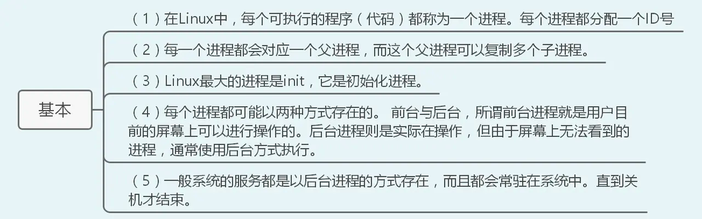

# 进程管理
## 进程的概念

在linux中，每个可执行的程序都是一个进程，每个进程都有一个id号

每个进程都有两种存在形式-前台和后台

## 管理进程相关的操作
### ps [选项]

-a 显示当前终端的所有进程信息

-u 用户格式显示进程信息

-x 显示后台进程运行的参数

-e 显示所有进程

-f 全格式

#### 常见返回信息

PID 进程识别号

TTY 终端机号

TIME 此进程消耗的CPU时间

CMD 正在执行的命令或者进程名

CPU 此进程占用的CPU使用率

RSS 使用的内存情况

STAT 进程的状态 s 休眠 r 运行中 D阻塞 Z僵死 T结束

### kill 终止进程
kill [选项] 进程号
kill [选项] 进程名称

常用选项
```shell
HUP     1    终端挂断
INT     2    中断（同 Ctrl + C）
QUIT    3    退出（同 Ctrl + \）
KILL    9    强制终止
TERM   15    终止
CONT   18    继续（与STOP相反，fg/bg命令）
STOP   19    暂停（同 Ctrl + Z）
```

### top 动态监控进程状态
top[选项]

常用选项

-d 更新间隔s
-i 使top不显示闲置和僵死进程
-P 通过指定id来监控指定进程

P按cpu使用率进行排序
M 内存排序
N pid排序
q退出

```shell
输入top后再输入u，可以查看特定用户的进程
输入k可以关闭进程
top -d 10
```
