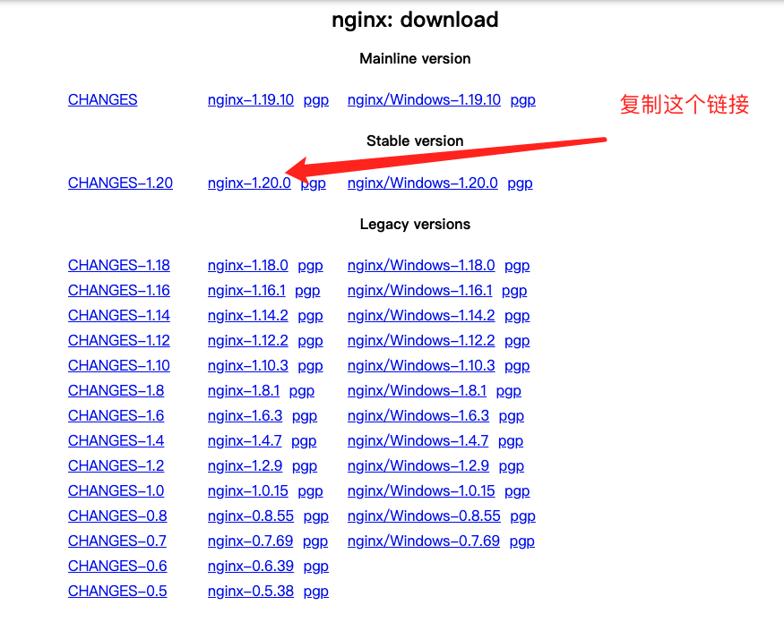
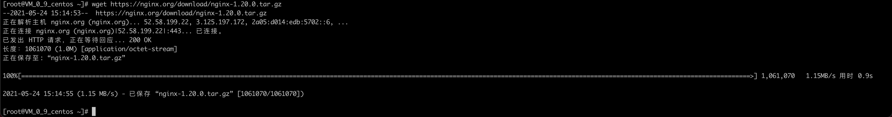
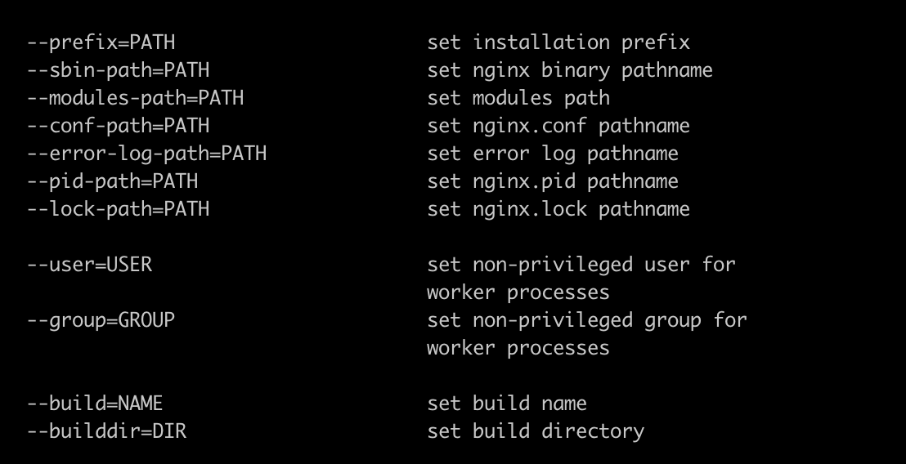
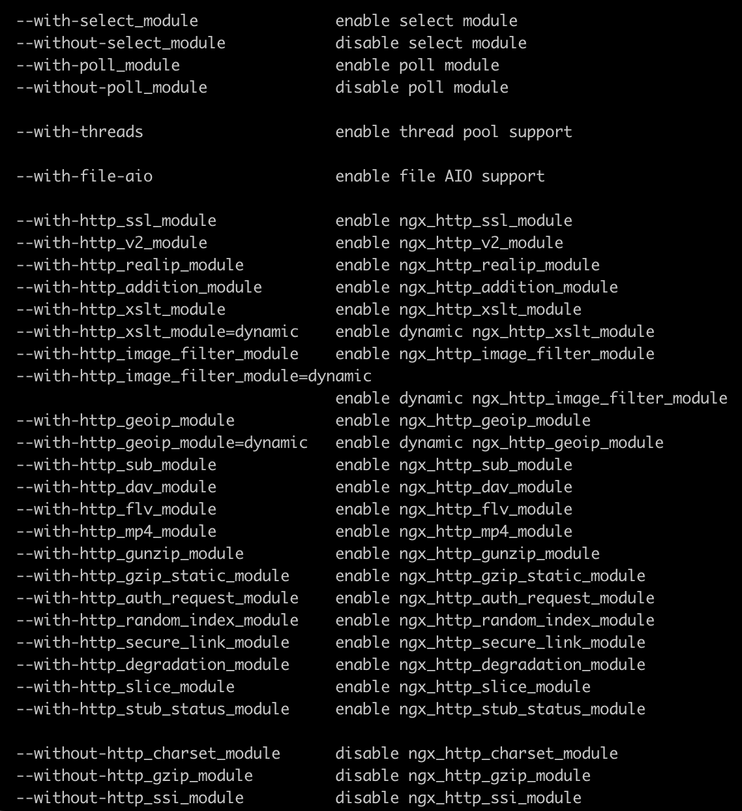
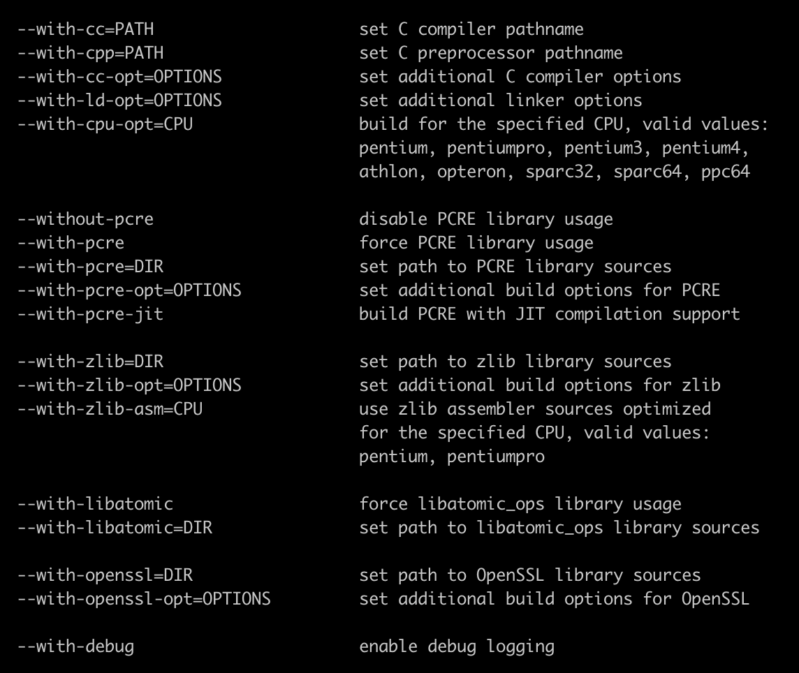
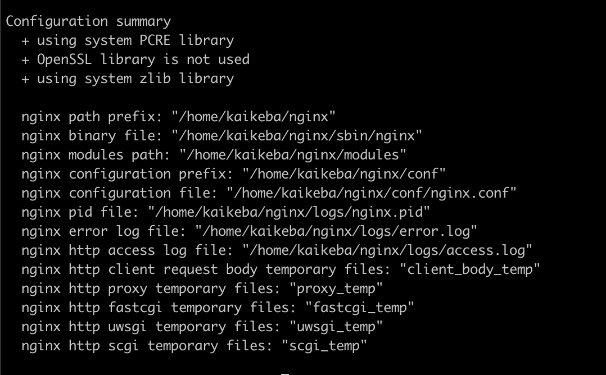
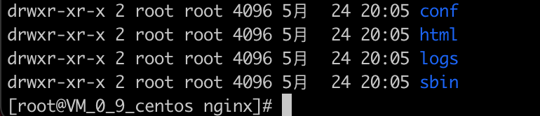

## 其他安装方式
编译安装

## 安装

https://nginx.org/

### download




- Mainline version
最新的版本
- Stable version
稳定的版本
- Legacy versions
历史版本

我们选择稳定的版本: `nginx-1.20.0`

```sh
wget https://nginx.org/download/nginx-1.20.0.tar.gz
```



### 解压
```sh
tar -xzf nginx-1.20.0.tar.gz
```
> -x 从压缩文件中还原文件。
>
> -z 通过gzip指令处理压缩文件。
>
> -f 指定压缩文件。
>
> 具体可以查看 `tar` 的命令

## 编译

### 参数介绍
```sh
./configure --help | more
```

nginx执行过程中会找哪些目录下的哪些文件，做为他的辅助文件。

如果没有任何变动，只需要指定 ```--prefix``` 这个参数就行。


在执行过程中表示使用或者不使用哪些文件。一般以 `with` 或者 `without` 开头。

- `with` 开头的模块默认是不会打包进nginx中的。
> 加了代表会被打包进去

- `without` 开头的默认会被编译进nginx中的。
> 加了表示会被移除


nginx编译中需要的一些特殊的参数，比如用到了gcc编译时候需要加一些参数、或者需要打印debug级别的日志。

### 默认编译

```sh
./configure  --prefix=/home/kaikeba/nginx
```

代表使用的是默认编译，编译到目录 `/home/kaikeba/nginx` 。



### make编译
```sh
make
```
如果没有任何错误，就编译完成了，生成了大量的中间文件，并最终生成了可以运行的nginx二进制文件。可以在objs目录查看。

nginx的目标文件放在objs/nginx这里。

如果我们要对nginx进行升级，不能执行 `make install`. 需要在`objs`目录把nginx执行文件copy到安装目录中。

c语言编译时生成的所有中间文件，都会放在 `objs/src` 目录。

如果使用动态模块编译，会生成对应的 `.so` 文件也会放在 `objs` 目录下。

### make install
首次安装时候使用这个命令。

安装完毕以后

```sh
cd /home/kaikeba/nginx
```
这里就是之前指定的安装目录。


- sbin

    执行文件目录

- conf

    配置文件目录，默认是从之前源码的conf目录中copy了一份过来

- logs

    日志目录

- html

    默认的网页目录

### 软连接

因为我们 `--prefix` 指定的安装目录不是 `/usr/bin/nginx`，所以需要软连接到执行目录之后才能全局使用。

```sh
ln -s /home/kaikeba/nginx/sbin/nginx /usr/bin
```

### 启动nginx

```sh
nginx
```

