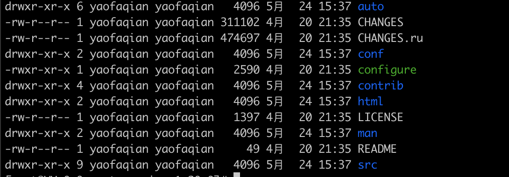
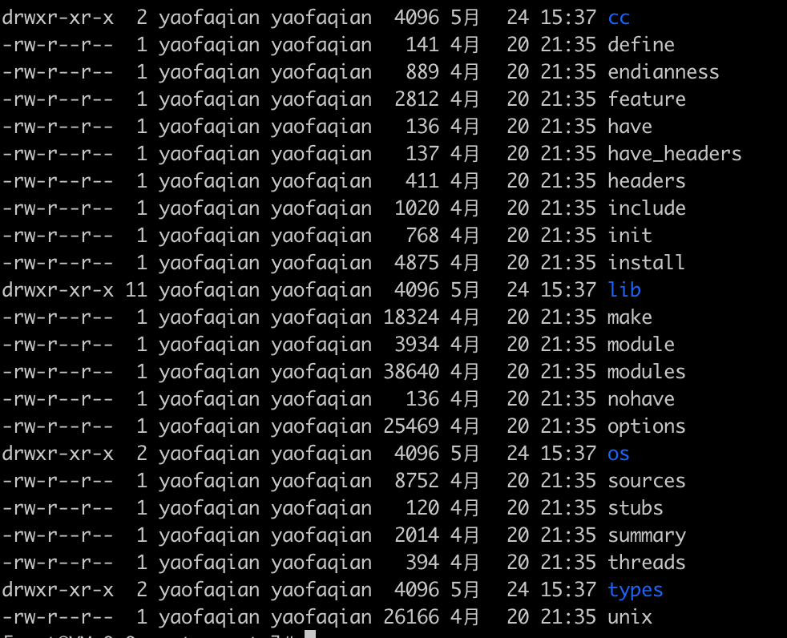
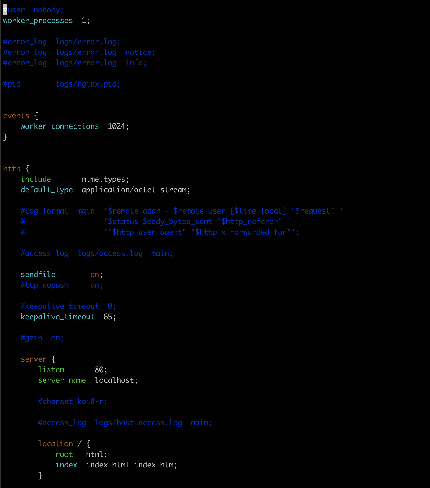
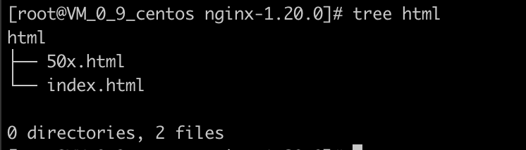

# 源码目录


## auto


- cc
编译用的
- lib
lib库
- os
对所有的操作系统的判断

其余都是判定config脚本在执行的时候，判定nginx支持哪些模块，当前操作系统有哪些特性可以供给nginx使用

## CHANGES
介绍了nginx中，每个版本提供了 `什么特性` 和 `Bug fix`。

- feature

- changes

- bugfix

## CHANGES.ru
俄罗斯版本的 `CHANGES` 文件。

## conf
存放示例文件，为了方便配置，编译的时候会把conf中的示例文件copy到安装目录使用。

## configure
configure 脚本是用来生成中间文件，是编译前的一个必备动作。

## contrib
提供了两个 perl 脚本和vim工具，都在README中有介绍。

比如，我们没有使用vim打开nginx配置文件的时候，会发现它的色彩几乎没有什么变化。

我们可以将 `contrib` 下的 `vim`， `copy` 到 `～/.vim`，再使用vim打开就会发现nginx的配置文件增加了语法高亮

```sh
vim conf/nginx.conf
# 这个时候发现是默认的vim颜色，一般只由白色和蓝色组成。

cp -r contrib/vim/* ~/.vim
# 这里如果提示.vim不存在的话可以手动创建一下

vim conf/nginx.conf
# 这里nginx配置文件的语法高量就有了
```


## html



